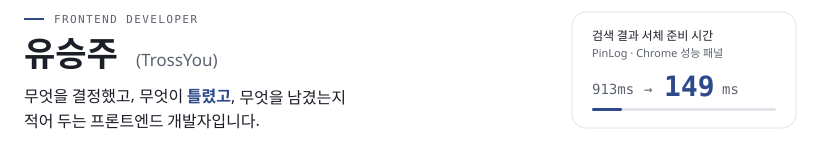
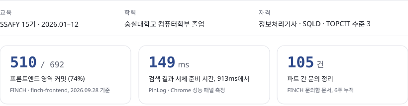
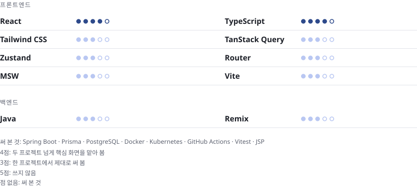
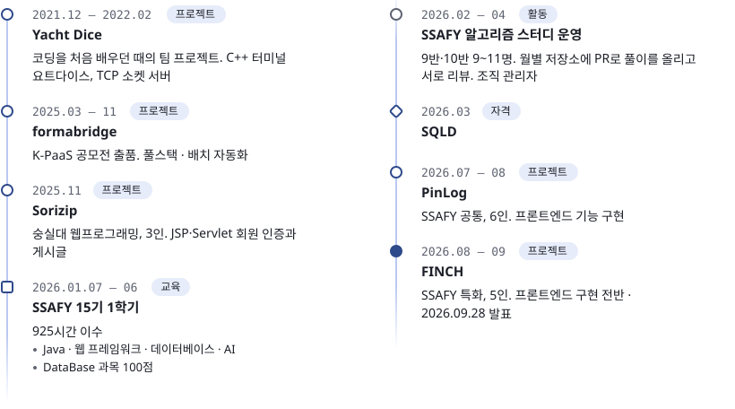

<!-- ─────────────── Hero ─────────────── -->
<picture>
  <source media="(prefers-color-scheme: dark)" srcset="./assets/hero-dark.svg">
  
</picture>

  <picture>
    <source media="(prefers-color-scheme: dark)" srcset="https://readme-typing-svg.demolab.com?font=JetBrains+Mono&weight=500&size=14&duration=4000&pause=2000&color=A1A5B0&center=true&vCenter=true&width=520&lines=Frontend+Developer;React+%C2%B7+TypeScript;decided+%2F+wrong+%2F+left+behind">
    
  </picture>

<a href="https://trossyou.github.io/portfolio/"><picture><source media="(prefers-color-scheme: dark)" srcset="https://img.shields.io/badge/Portfolio-4C6CB3?style=for-the-badge"></picture></a>
  
<a href="mailto:seungju.you1@gmail.com"><code>seungju.you1@gmail.com</code></a>

 

## About

프로젝트마다 **무엇을 결정했고, 무엇이 틀렸고, 무엇을 남겼는지** 적습니다. 결과물 전시가 아니라 판단의 기록입니다. 숫자에는 전부 출처가 있습니다.

<picture>
  <source media="(prefers-color-scheme: dark)" srcset="./assets/about2-dark.svg">
  
</picture>

 

## Skills

자주 쓴 것과 써 본 것을 나눴습니다.

<picture>
  <source media="(prefers-color-scheme: dark)" srcset="./assets/skills-dark.svg">
  
</picture>

 

## Projects

<picture>
  <source media="(prefers-color-scheme: dark)" srcset="./assets/header-frontend-dark.svg">
  
</picture>

### FINCH · 대표 프로젝트 내 계좌와 성향을 읽고 투자 판단을 돕는 AI 비서가 있는 증권 앱 2026.08–09 · 6주 · 5인 · SSAFY 특화 · 프론트엔드 구현 전반

<table>
  <tr>
    <td width="72" valign="top"><b>구현</b></td>
    <td>종목 상세 · 홈 · AI 채팅 · 예수금 · 주문 화면. 백엔드가 중계하는 시세의 화면 단위 구독·해제, 기간별 캔들 차트, 시장가 매수·매도</td>
  </tr>
  <tr>
    <td width="72" valign="top"><b>설계</b></td>
    <td>아는 에러 코드일 때만 재발급하도록 인증 인터셉터의 방어 방향을 잡음. API 계약 문서와 목 서버(MSW)를 프론트 쪽에서 관리</td>
  </tr>
  <tr>
    <td width="72" valign="top"><b>기여</b></td>
    <td>프론트엔드 영역 커밋 510 / 692 (74%) · 머지된 작업 브랜치 156 / 204 (76%) · 파트 간 문의 105건 정리</td>
  </tr>
  <tr>
    <td width="72" valign="top"><b>스택</b></td>
    <td><code>React 19</code> <code>TypeScript</code> <code>TanStack Query</code> <code>Zustand</code> <code>Zod</code> <code>MSW</code> <code>lightweight-charts</code></td>
  </tr>
</table>

<a href="https://finchapp.org"><picture><source media="(prefers-color-scheme: dark)" srcset="https://img.shields.io/badge/Live-4C6CB3?style=for-the-badge"></picture></a> <a href="https://youtu.be/4Cbu0-vMve4"><picture><source media="(prefers-color-scheme: dark)" srcset="https://img.shields.io/badge/Demo-4C6CB3?style=for-the-badge&logo=youtube&logoColor=white"></picture></a> <a href="https://github.com/TrossYou/portfolio/blob/main/case-studies/finch.md"><picture><source media="(prefers-color-scheme: dark)" srcset="https://img.shields.io/badge/Case_Study-4C6CB3?style=for-the-badge"></picture></a> <a href="https://github.com/Team-FINCH/finch-frontend"><picture><source media="(prefers-color-scheme: dark)" srcset="https://img.shields.io/badge/Repo-4C6CB3?style=for-the-badge&logo=github&logoColor=white"></picture></a>

 

### PinLog 장소 이름이 기억나지 않아도 경험과 감정으로 다시 찾는 AI 장소 기록 서비스 2026.07–08 · 5주 · 6인 · SSAFY 공통 · 프론트엔드 기능 구현

<table>
  <tr>
    <td width="72" valign="top"><b>구현</b></td>
    <td>지도 기반 기록 · 자연어 검색 결과 화면 · 컬렉션 피드</td>
  </tr>
  <tr>
    <td width="72" valign="top"><b>성능</b></td>
    <td>검색 결과 서체 준비 시간 <b>913ms → 149ms</b>. 결과 표시보다 약 806ms 먼저 준비</td>
  </tr>
  <tr>
    <td width="72" valign="top"><b>기여</b></td>
    <td>프론트엔드 저장소 커밋 178 / 206 (86%)</td>
  </tr>
  <tr>
    <td width="72" valign="top"><b>스택</b></td>
    <td><code>React 19</code> <code>TypeScript</code> <code>TanStack Query</code> <code>TanStack Router</code> <code>Vitest</code></td>
  </tr>
</table>

<a href="https://youtu.be/lD5MbHL9TZ8"><picture><source media="(prefers-color-scheme: dark)" srcset="https://img.shields.io/badge/Demo-4C6CB3?style=for-the-badge&logo=youtube&logoColor=white"></picture></a> <a href="https://github.com/TrossYou/portfolio/blob/main/case-studies/pinlog.md"><picture><source media="(prefers-color-scheme: dark)" srcset="https://img.shields.io/badge/Case_Study-4C6CB3?style=for-the-badge"></picture></a> <a href="https://github.com/Team-PinLog/front"><picture><source media="(prefers-color-scheme: dark)" srcset="https://img.shields.io/badge/Repo-4C6CB3?style=for-the-badge&logo=github&logoColor=white"></picture></a>

 

<picture>
  <source media="(prefers-color-scheme: dark)" srcset="./assets/header-fullstack-dark.svg">
  
</picture>

### formabridge 좋아하는 음악을 기록하는 음악 SNS 서비스 2025.03–11 · 4인 · K-PaaS 공모전 · 풀스택 · 배치 자동화

<table>
  <tr>
    <td width="72" valign="top"><b>구현</b></td>
    <td>Google OAuth + JWT 인증, 메모 · 검색 · 팔로우 기능(Remix loader/action · Prisma 모델까지), Spotify API 연동, 모바일 반응형 UI</td>
  </tr>
  <tr>
    <td width="72" valign="top"><b>배치</b></td>
    <td>Spotify ID 백필 배치 스크립트와, 그것을 GitHub Actions에서 K8s Job으로 실행하는 공통 러너·워크플로 작성</td>
  </tr>
  <tr>
    <td width="72" valign="top"><b>기여</b></td>
    <td>담당 커밋 53 / 184 (29%) · 머지된 PR 54건 (전체 186건)</td>
  </tr>
  <tr>
    <td width="72" valign="top"><b>스택</b></td>
    <td><code>Remix</code> <code>TypeScript</code> <code>Prisma</code> <code>PostgreSQL</code> <code>Docker</code> <code>Kubernetes</code></td>
  </tr>
</table>

<a href="https://github.com/TrossYou/portfolio/blob/main/case-studies/formabridge.md"><picture><source media="(prefers-color-scheme: dark)" srcset="https://img.shields.io/badge/Case_Study-4C6CB3?style=for-the-badge"></picture></a> <a href="https://github.com/formalBridge/project_alpha"><picture><source media="(prefers-color-scheme: dark)" srcset="https://img.shields.io/badge/Repo-4C6CB3?style=for-the-badge&logo=github&logoColor=white"></picture></a>

 

### Sorizip 중고 악기 거래 플랫폼 2025.11 · 3인 · 숭실대 웹프로그래밍 · 회원 인증 · 게시글 관리

<table>
  <tr>
    <td width="72" valign="top"><b>구현</b></td>
    <td>처음 다룬 JSP/Servlet으로 회원 인증과 게시글 관리</td>
  </tr>
  <tr>
    <td width="72" valign="top"><b>속도</b></td>
    <td>첫 커밋에서 담당 기능 완료까지 6일</td>
  </tr>
  <tr>
    <td width="72" valign="top"><b>기여</b></td>
    <td>담당 커밋 13 / 66 · 과목 최종 A+ (98점)</td>
  </tr>
  <tr>
    <td width="72" valign="top"><b>스택</b></td>
    <td><code>Java 17</code> <code>JSP</code> <code>Servlet</code> <code>Tomcat</code> <code>MySQL</code> <code>HikariCP</code></td>
  </tr>
</table>

<a href="https://github.com/dongcheolpark/sorizip"><picture><source media="(prefers-color-scheme: dark)" srcset="https://img.shields.io/badge/Repo-4C6CB3?style=for-the-badge&logo=github&logoColor=white"></picture></a>

 

<picture>
  <source media="(prefers-color-scheme: dark)" srcset="./assets/header-others-dark.svg">
  
</picture>

<table>
  <tr>
    <td width="33%" valign="top">
      <b>algorithm</b> 
      알고리즘 풀이의 접근·오답 원인을 기록하는 학습 로그 대시보드 
      2024– · 개인 · Java · Vanilla JS  
      의존성 없이 단일 HTML 파일, 힘 기반 그래프 레이아웃으로 유형 편중과 복습 대기를 본다  
      <a href="https://trossyou.github.io/algorithm/"><picture><source media="(prefers-color-scheme: dark)" srcset="https://img.shields.io/badge/Live-4C6CB3?style=for-the-badge"></picture></a> <a href="https://github.com/TrossYou/algorithm"><picture><source media="(prefers-color-scheme: dark)" srcset="https://img.shields.io/badge/Repo-4C6CB3?style=for-the-badge&logo=github&logoColor=white"></picture></a>
    </td>
    <td width="33%" valign="top">
      <b>mood-music-recommender</b> 
      이미지의 인물과 배경 분위기를 따로 읽어 음악을 추천하는 시스템 
      2025.06 · 개인 · CLIP · YOLOv8  
      31장 평가셋에서 인물 가중치 0.4~0.9를 여섯 단계로 비교해 8:2 선택. 가중치 0.4 대비 정답률 <b>0.2903 → 0.6129</b>  
      <a href="https://github.com/TrossYou/mood-music-recommender"><picture><source media="(prefers-color-scheme: dark)" srcset="https://img.shields.io/badge/Repo-4C6CB3?style=for-the-badge&logo=github&logoColor=white"></picture></a>
    </td>
    <td width="33%" valign="top">
      <b>xv6-mlfq-scheduler</b> 
      xv6 커널에 4단계 다단계 피드백 큐 스케줄러를 직접 구현한 과제 
      2024.02–06 · 개인 · C  
      과제 명세가 정한 MLFQ와 Aging을 커널 코드 수준에서 구현  
      <a href="https://github.com/TrossYou/xv6-mlfq-scheduler"><picture><source media="(prefers-color-scheme: dark)" srcset="https://img.shields.io/badge/Repo-4C6CB3?style=for-the-badge&logo=github&logoColor=white"></picture></a>
    </td>
  </tr>
</table>

 

## Activity

배운 순서대로 적었습니다.

<picture>
  <source media="(prefers-color-scheme: dark)" srcset="./assets/timeline-dark.svg">
  
</picture>

 

## How I Work

성향마다 근거를 하나씩 붙였습니다. 점수는 없습니다.

<table>
  <tr>
    <td width="33%" valign="top">
      <b>스스로 일을 찾아서 한다</b>  
      백엔드 응답을 기다리는 동안 API 계약 문서와 목 서버를 먼저 만들어 팀 전원이 썼습니다.  
      근거: <a href="https://github.com/TrossYou/portfolio/blob/main/case-studies/finch.md#확정된-것과-가정한-것을-문서로-갈라-두고-먼저-만들었다">FINCH · 확정된 것과 가정한 것을 문서로 갈라 두고 먼저 만들었다</a>
    </td>
    <td width="33%" valign="top">
      <b>파트 간 의사소통</b>  
      6주 동안 파트 간 문의 105건을 한 문서에 정리하고, 답이 어긋나면 고치기 전에 왜 어긋났는지부터 물었습니다.  
      근거: <a href="https://github.com/TrossYou/portfolio/blob/main/case-studies/finch.md#어긋난-것을-고치기-전에-왜-어긋났는지부터-물었다">FINCH · 어긋난 것을 고치기 전에, 왜 어긋났는지부터 물었다</a>
    </td>
    <td width="33%" valign="top">
      <b>틀린 것을 기록한다</b>  
      제가 올리자고 한 이슈가 틀렸던 경위를 케이스 스터디에 그대로 남겼습니다.  
      근거: <a href="https://github.com/TrossYou/portfolio/blob/main/case-studies/finch.md#제가-올리자고-한-이슈가-틀렸다">FINCH · 제가 올리자고 한 이슈가 틀렸다</a>
    </td>
  </tr>
</table>

### 에이전트 하네스

`2026.07– · 개인 · PinLog에서 시작해 FINCH와 취업 준비까지`

AI 코딩 에이전트에게 구현과 문서와 기록을 맡기면서, 무엇을 맡기고 무엇을 사람이 쥘지를 정해 둔 운영 방식입니다. 에이전트는 구현·커밋·초안 작성까지 하고, 무엇을 할지와 팀에 무엇을 보낼지는 제가 정합니다. 경계는 에이전트의 실력이 아니라 되돌릴 수 있는가로 그었습니다.

<a href="https://github.com/TrossYou/portfolio/blob/main/case-studies/harness.md"><picture><source media="(prefers-color-scheme: dark)" srcset="https://img.shields.io/badge/Case_Study-4C6CB3?style=for-the-badge"></picture></a>
