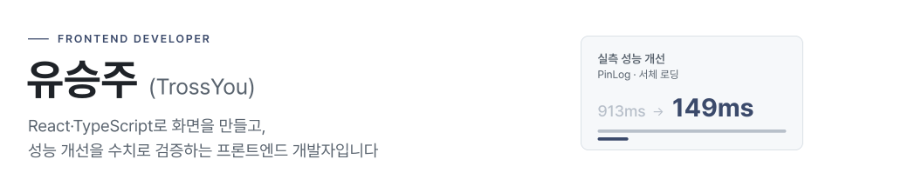
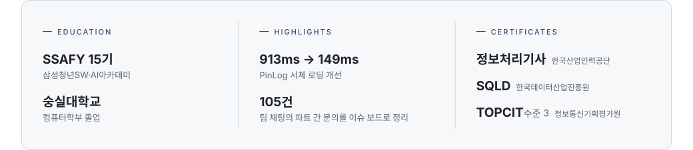

<!-- ─────────────── Hero Banner ─────────────── -->
<picture>
  <source media="(prefers-color-scheme: dark)" srcset="./assets/banner-dark.svg">
  
</picture>

<!-- ─────────────── Typing ─────────────── -->

  <picture>
    <source media="(prefers-color-scheme: dark)" srcset="https://readme-typing-svg.demolab.com?font=Inter&weight=400&size=18&duration=4500&pause=2500&color=9198A1&center=true&vCenter=true&width=500&lines=Frontend+Developer;React+%C2%B7+TypeScript;913ms+%E2%86%92+149ms%2C+verified+by+numbers">
    
  </picture>

<a href="https://trossyou.github.io/portfolio/"><picture><source media="(prefers-color-scheme: dark)" srcset="https://img.shields.io/badge/Visit_Portfolio-4C6CB3?style=for-the-badge"></picture></a>
<a href="mailto:seungju.you1@gmail.com"><picture><source media="(prefers-color-scheme: dark)" srcset="https://img.shields.io/badge/Send_Mail-4C6CB3?style=for-the-badge&logo=gmail&logoColor=white"></picture></a>
 
<code>seungju.you1@gmail.com</code>

 

## About

<picture>
  <source media="(prefers-color-scheme: dark)" srcset="./assets/about-dark.svg">
  
</picture>

 

## Tech Stack

**Frontend**

<picture><source media="(prefers-color-scheme: dark)" srcset="https://img.shields.io/badge/React-20232A?style=flat&logo=react&logoColor=61DAFB"></picture>
<picture><source media="(prefers-color-scheme: dark)" srcset="https://img.shields.io/badge/TypeScript-3178C6?style=flat&logo=typescript&logoColor=white"></picture>
<picture><source media="(prefers-color-scheme: dark)" srcset="https://img.shields.io/badge/Vite-646CFF?style=flat&logo=vite&logoColor=white"></picture>
<picture><source media="(prefers-color-scheme: dark)" srcset="https://img.shields.io/badge/TanStack_Query-FF4154?style=flat&logo=reactquery&logoColor=white"></picture>
<picture><source media="(prefers-color-scheme: dark)" srcset="https://img.shields.io/badge/TanStack_Router-1F2937?style=flat&logo=tanstack&logoColor=white"></picture>
<picture><source media="(prefers-color-scheme: dark)" srcset="https://img.shields.io/badge/Zustand-443E38?style=flat"></picture>
<picture><source media="(prefers-color-scheme: dark)" srcset="https://img.shields.io/badge/Tailwind_CSS-06B6D4?style=flat&logo=tailwindcss&logoColor=white"></picture>
<picture><source media="(prefers-color-scheme: dark)" srcset="https://img.shields.io/badge/Remix-000000?style=flat&logo=remix&logoColor=white"></picture>

**Validation & Test**

<picture><source media="(prefers-color-scheme: dark)" srcset="https://img.shields.io/badge/Zod-3E67B1?style=flat&logo=zod&logoColor=white"></picture>
<picture><source media="(prefers-color-scheme: dark)" srcset="https://img.shields.io/badge/MSW-FF6A33?style=flat&logo=mockserviceworker&logoColor=white"></picture>
<picture><source media="(prefers-color-scheme: dark)" srcset="https://img.shields.io/badge/Vitest-6E9F18?style=flat&logo=vitest&logoColor=white"></picture>

**Backend · Infra**

<picture><source media="(prefers-color-scheme: dark)" srcset="https://img.shields.io/badge/Java-ED8B00?style=flat&logo=openjdk&logoColor=white"></picture>
<picture><source media="(prefers-color-scheme: dark)" srcset="https://img.shields.io/badge/Prisma-2D3748?style=flat&logo=prisma&logoColor=white"></picture>
<picture><source media="(prefers-color-scheme: dark)" srcset="https://img.shields.io/badge/PostgreSQL-4169E1?style=flat&logo=postgresql&logoColor=white"></picture>
<picture><source media="(prefers-color-scheme: dark)" srcset="https://img.shields.io/badge/Docker-2496ED?style=flat&logo=docker&logoColor=white"></picture>
<picture><source media="(prefers-color-scheme: dark)" srcset="https://img.shields.io/badge/Kubernetes-326CE5?style=flat&logo=kubernetes&logoColor=white"></picture>
<picture><source media="(prefers-color-scheme: dark)" srcset="https://img.shields.io/badge/GitHub_Actions-2088FF?style=flat&logo=githubactions&logoColor=white"></picture>

 

## Projects

<picture>
  <source media="(prefers-color-scheme: dark)" srcset="./assets/section-frontend-dark.svg">
  
</picture>

#### FINCH — AI 비서가 있는 증권 앱
`2026.08 ~ 09` · 5인 팀 · SSAFY · 프론트엔드 구현 전반

<table>
  <tr>
    <td width="72" valign="top"><b>구현</b></td>
    <td>종목 상세 · 홈 · AI 채팅 · 예수금 · 주문 화면 (실시간 시세 구독, 기간별 캔들 차트, 시장가 매수·매도)</td>
  </tr>
  <tr>
    <td width="72" valign="top"><b>설계</b></td>
    <td>아는 에러 코드일 때만 재발급하도록 인증 인터셉터의 방어 방향을 잡음</td>
  </tr>
  <tr>
    <td width="72" valign="top"><b>기여</b></td>
    <td>프론트엔드 영역 커밋 692건 중 510건(74%)</td>
  </tr>
  <tr>
    <td width="72" valign="top"><b>스택</b></td>
    <td><code>React</code> <code>TypeScript</code> <code>TanStack Query</code> <code>Zustand</code> <code>Zod</code> <code>MSW</code></td>
  </tr>
</table>

<a href="https://finchapp.org"><picture><source media="(prefers-color-scheme: dark)" srcset="https://img.shields.io/badge/Live-4C6CB3?style=for-the-badge"></picture></a> <a href="https://youtu.be/4Cbu0-vMve4"><picture><source media="(prefers-color-scheme: dark)" srcset="https://img.shields.io/badge/Demo-4C6CB3?style=for-the-badge&logo=youtube&logoColor=white"></picture></a> <a href="https://github.com/Team-FINCH/finch-frontend"><picture><source media="(prefers-color-scheme: dark)" srcset="https://img.shields.io/badge/Repo-4C6CB3?style=for-the-badge&logo=github&logoColor=white"></picture></a>

#### PinLog — AI 장소 기록 서비스
`2026.07 ~ 08` · 6인 팀 · SSAFY · 프론트엔드 기능 구현

<table>
  <tr>
    <td width="72" valign="top"><b>구현</b></td>
    <td>지도 기반 기록 · 자연어 검색 결과 화면 · 컬렉션 피드</td>
  </tr>
  <tr>
    <td width="72" valign="top"><b>성능</b></td>
    <td>서체 내려받기 <b>913ms → 149ms</b>, 결과 표시보다 약 806ms 먼저 준비</td>
  </tr>
  <tr>
    <td width="72" valign="top"><b>기여</b></td>
    <td>프론트엔드 저장소 커밋 206건 중 178건(86%)</td>
  </tr>
  <tr>
    <td width="72" valign="top"><b>스택</b></td>
    <td><code>React</code> <code>TypeScript</code> <code>TanStack Query</code> <code>TanStack Router</code> <code>Vitest</code></td>
  </tr>
</table>

<a href="https://youtu.be/lD5MbHL9TZ8"><picture><source media="(prefers-color-scheme: dark)" srcset="https://img.shields.io/badge/Demo-4C6CB3?style=for-the-badge&logo=youtube&logoColor=white"></picture></a> <a href="https://github.com/TrossYou/portfolio/blob/main/pinlog.md"><picture><source media="(prefers-color-scheme: dark)" srcset="https://img.shields.io/badge/Case_Study-4C6CB3?style=for-the-badge"></picture></a> <a href="https://github.com/Team-PinLog/front"><picture><source media="(prefers-color-scheme: dark)" srcset="https://img.shields.io/badge/Repo-4C6CB3?style=for-the-badge&logo=github&logoColor=white"></picture></a>

 

<picture>
  <source media="(prefers-color-scheme: dark)" srcset="./assets/section-fullstack-dark.svg">
  
</picture>

#### formabridge — 음악 SNS 서비스
`2025.03 ~ 11` · 4인 팀 · K-PaaS 공모전 출품 · 풀스택

<table>
  <tr>
    <td width="72" valign="top"><b>구현</b></td>
    <td>Google OAuth + JWT, Spotify API 연동, 팔로우 시스템, 모바일 반응형 UI</td>
  </tr>
  <tr>
    <td width="72" valign="top"><b>배포</b></td>
    <td>Docker · K8s · GitHub Actions로 배포 파이프라인 구축</td>
  </tr>
  <tr>
    <td width="72" valign="top"><b>스택</b></td>
    <td><code>Remix</code> <code>TypeScript</code> <code>Prisma</code> <code>PostgreSQL</code> <code>Docker</code> <code>Kubernetes</code></td>
  </tr>
</table>

<a href="https://github.com/TrossYou/portfolio/blob/main/formabridge.md"><picture><source media="(prefers-color-scheme: dark)" srcset="https://img.shields.io/badge/Case_Study-4C6CB3?style=for-the-badge"></picture></a> <a href="https://github.com/formalBridge/project_alpha"><picture><source media="(prefers-color-scheme: dark)" srcset="https://img.shields.io/badge/Repo-4C6CB3?style=for-the-badge&logo=github&logoColor=white"></picture></a>

#### Sorizip — 중고 악기 거래 플랫폼
`2025.11` · 3인 팀 · 숭실대학교 웹프로그래밍 · 회원 인증 · 게시글 관리

<table>
  <tr>
    <td width="72" valign="top"><b>구현</b></td>
    <td>처음 다룬 JSP/Servlet으로 회원 인증과 게시글 관리</td>
  </tr>
  <tr>
    <td width="72" valign="top"><b>속도</b></td>
    <td>첫 커밋에서 담당 기능 완료까지 6일</td>
  </tr>
  <tr>
    <td width="72" valign="top"><b>기여</b></td>
    <td>담당 커밋 64건 중 13건 · 과목 최종 A+(98점)</td>
  </tr>
  <tr>
    <td width="72" valign="top"><b>스택</b></td>
    <td><code>Java 17</code> <code>JSP</code> <code>Servlet</code> <code>Tomcat</code> <code>MySQL</code> <code>HikariCP</code></td>
  </tr>
</table>

<a href="https://github.com/dongcheolpark/sorizip"><picture><source media="(prefers-color-scheme: dark)" srcset="https://img.shields.io/badge/Repo-4C6CB3?style=for-the-badge&logo=github&logoColor=white"></picture></a>

 

<picture>
  <source media="(prefers-color-scheme: dark)" srcset="./assets/section-others-dark.svg">
  
</picture>

<table>
  <tr>
    <td width="33%" valign="top">
      <b>학습 로그 대시보드</b> 
      Vanilla JS  
      알고리즘 풀이의 접근·오답 원인을 기록하고 약점을 추적하는 도구. 의존성 없이 단일 HTML 파일, 힘 기반 그래프 레이아웃으로 구현  
      <a href="https://trossyou.github.io/algorithm/"><picture><source media="(prefers-color-scheme: dark)" srcset="https://img.shields.io/badge/Live-4C6CB3?style=for-the-badge"></picture></a> <a href="https://github.com/TrossYou/algorithm"><picture><source media="(prefers-color-scheme: dark)" srcset="https://img.shields.io/badge/Repo-4C6CB3?style=for-the-badge&logo=github&logoColor=white"></picture></a>
    </td>
    <td width="33%" valign="top">
      <b>mood-music-recommender</b> 
      개인 · YOLOv8 · CLIP  
      이미지 분위기로 음악을 추천. 31장 평가셋에서 인물 가중치 0.4~0.9를 6단계로 비교해 인물·배경 8:2 선택, 가중치 0.4 대비 정답률 <b>0.2903 → 0.6129</b>  
      <a href="https://github.com/TrossYou/mood-music-recommender"><picture><source media="(prefers-color-scheme: dark)" srcset="https://img.shields.io/badge/Repo-4C6CB3?style=for-the-badge&logo=github&logoColor=white"></picture></a>
    </td>
    <td width="33%" valign="top">
      <b>xv6 MLFQ 스케줄러</b> 
      과제 · C · xv6  
      과제 명세가 정한 다단계 피드백 큐와 Aging을 xv6 커널에 구현  
      <a href="https://github.com/TrossYou/xv6-mlfq-scheduler"><picture><source media="(prefers-color-scheme: dark)" srcset="https://img.shields.io/badge/Repo-4C6CB3?style=for-the-badge&logo=github&logoColor=white"></picture></a>
    </td>
  </tr>
</table>

 

## How I Work

### 에이전트 하네스 — 일은 맡기고, 판단은 남겼다
`2026.07 ~` · 개인 · PinLog에서 시작해 FINCH와 취업 준비까지

AI 코딩 에이전트에게 구현과 문서와 기록을 맡기면서, 무엇을 맡기고 무엇을 사람이 쥘지를 정해 둔 운영 방식입니다.

<a href="https://github.com/TrossYou/portfolio/blob/main/harness.md"><picture><source media="(prefers-color-scheme: dark)" srcset="https://img.shields.io/badge/Case_Study-4C6CB3?style=for-the-badge"></picture></a>
